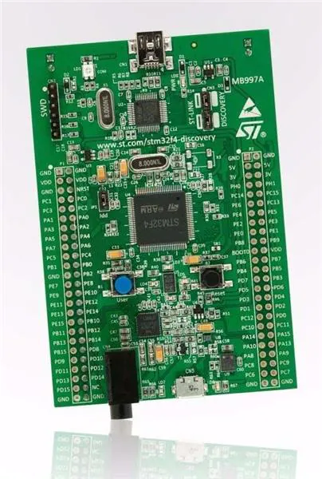

# MP3 Player with DAC and STM32F4DISCOVERY

This repository contains the code and documentation for an MP3 player project using the STM32F4DISCOVERY microcontroller board and DAC integration. The project aims to develop a high-quality MP3 player with advanced features and user-friendly controls.

## Features

- MP3 decoding and playback functionality.
- Integration with a DAC for accurate audio conversion.
- Support for various audio file formats and bitrates.
- User-friendly interface with buttons, switches, or an LCD display.
- File management features, including track browsing and selection.
- Volume control and equalizer options.
- Expandable storage support.
- Power management for efficient usage.

## Getting Started

To get started with the MP3 player project, follow these steps:

1. Clone this repository to your local machine.
2. Install the required development tools and dependencies (provide instructions if any).
3. Connect the STM32F4DISCOVERY board to your computer.
4. Compile and upload the firmware to the microcontroller board.
5. Connect the necessary audio components, such as the DAC, speakers, or headphones.
6. Power on the MP3 player and start enjoying your music!

Refer to the documentation or project's code files for more detailed instructions on setup and usage.

## STM32F4DISCOVERY

The STM32F4DISCOVERY is a powerful and versatile development board based on the STM32F407VG microcontroller. It is designed to provide a flexible platform for prototyping and developing applications using the ARM Cortex-M4 32-bit RISC core.

### Features of STM32F4DISCOVERY

- High-performance STM32F407VG microcontroller running at up to 168 MHz clock speed.
- 1 MB Flash memory and 192 KB RAM for storing program code and data.
- Onboard ST-LINK/V2 debugger and programmer for easy programming and debugging.
- Various digital and analog peripherals, including UART, SPI, I2C, GPIO, ADC, DAC, and more, enabling integration with a wide range of sensors and devices.
- Onboard components such as LEDs, push-buttons, accelerometer, and audio DAC for quick testing and prototyping.
- Flexible power supply options: USB, external 5V supply, or ST-LINK/V2 USB supply.

### Getting Started with STM32F4DISCOVERY

To start using the STM32F4DISCOVERY board, follow these steps:

1. Connect the board to your computer using a USB cable or external power supply.
2. Install the necessary development tools and software (provide instructions if necessary).
3. Set up your preferred Integrated Development Environment (IDE) or toolchain for STM32 development.
4. Download the STM32Cube software package or other relevant software libraries for the STM32F4 series.
5. Explore the provided example projects and documentation to understand the board's capabilities and peripherals.
6. Build and upload the example code to the board to see it in action.
7. Start your own project by utilizing the available resources and expanding upon the examples.

## Contributing

Contributions to the MP3 player project are welcome! If you have ideas, improvements, or new features to add, please follow these steps:

1. Fork this repository.
2. Create a new branch for your contribution.
3. Make your changes and test thoroughly.
4. Submit a pull request with a clear description of your contribution.

Please ensure that your code follows the project's coding guidelines and maintain a clean commit history.

## Contact

If you have any questions or suggestions regarding the MP3 player project, please feel free to contact us. We appreciate your feedback and support!

